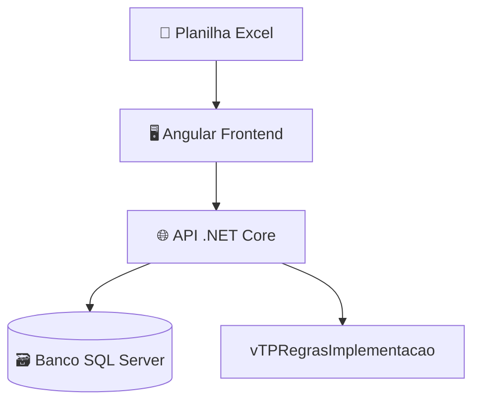

# 🧩 Componentes e Integrações

## Descrição
- **Excel**: Fonte de dados do usuário
- **Frontend**: Interface para envio do formulário
- **API**: Realiza cálculos, validações e persistência
- **Banco**: Guarda publicações e itens de preços
- **View de Regras**: Define exclusões ou inclusões