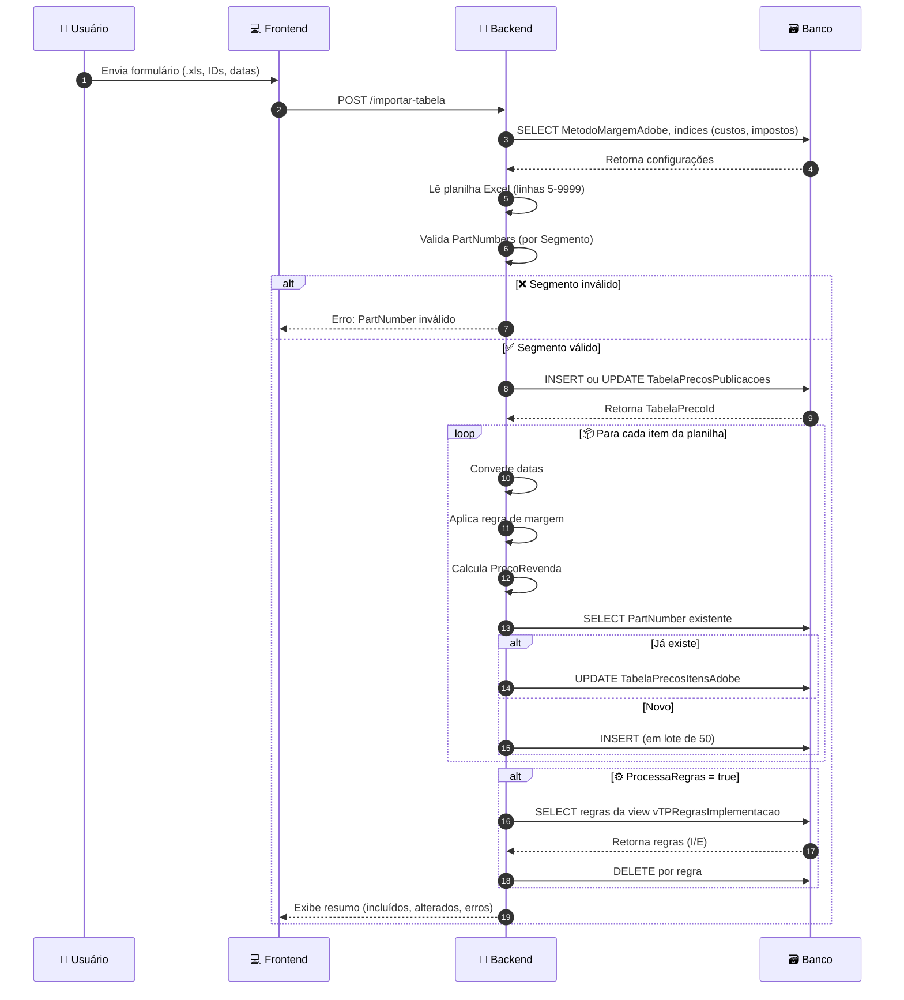
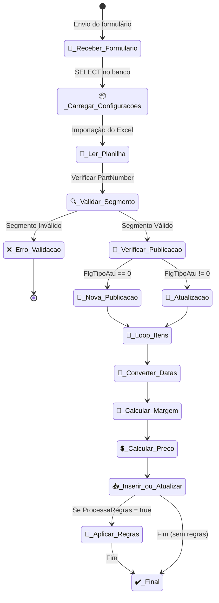
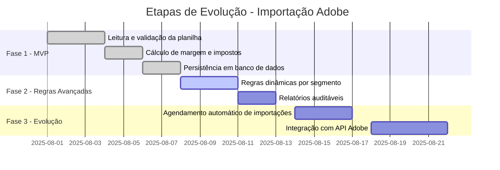

# 📄 Documentação Técnica - Importação de Tabela de Preços (Sistema Legado Adobe)

---

## 🧭 Índice de Seções

1. [📍 Visão Geral](#visão-geral)
2. [✅ Regras de Negócio Extraídas](#regras-de-negócio-extraídas)
3. [🔁 Fluxo de Atividades](#fluxo-de-atividades)
4. [🧱 Estruturas de Dados / Classes](#estruturas-de-dados--classes)
5. [🔣 Regras e Algoritmos](#regras-e-algoritmos)
6. [🗃️ Regras SQL e Integrações com Banco](#regras-sql-e-integrações-com-banco)
7. [🧪 Regras de Validação](#regras-de-validação)
8. [🔗 Dependências Externas](#dependências-externas)
9. [📊 Registros e Relatórios Gerados](#registros-e-relatórios-gerados)
10. [📈 Gráficos e Fluxogramas](#gráficos-e-fluxogramas)
    - [🧭 Diagrama de Atividades](diagrama_atividades_importacao.md)
    - [🧬 Diagrama de Fluxo UML](diagrama_fluxo_uml_importacao.md)
    - [📊 Diagrama de Sequência](diagrama_sequencia_importacao.md)
11. [🪜 Passo a Passo Detalhado](passo-a-passo-detalhado.md)
12. [📋 Histórias de Usuário (Backlog Ágil)](historias-usuario-importacao.md)

---

## 📍 Visão Geral

Este módulo realiza a **importação e atualização de tabelas de preços** de produtos Adobe a partir de uma planilha Excel, com validações específicas por segmento, cálculo de preços, regras de negócio dinâmicas e persistência de dados em múltiplas tabelas do banco de dados.

---

## ✅ Regras de Negócio Extraídas

### 🔸 Parâmetros do Formulário

- `FabricanteId`, `NomeArquivo`, `TabelaNome`, `DataInicio`, `TituloColunas`, `MargemBruta`, `FlgTipoAtu`, `SegmentoFabricante`, `SiglaSegmento`, `ProcessaRegras`.

### 🔸 Margens e Custos

- `MetodoMargemAdobe` determina se a margem é fixa ou por tipo de produto (ex: “Level 1”).
- Custos e impostos usados no cálculo: `CustoOperacional`, `PIS`, `COFINS`, `ISS`, `MargemMinima`, `ProdNivel1`, `OutrosProd`.

### 🔸 Importação de Planilha

- Começa na **linha 5 até a 9999**.
- Colunas definidas dinamicamente por `Form.TituloColunas`.

### 🔸 Validação de Segmento

- Se `SegmentoFabricante` **não** está na lista `ET,FL,DM,...`, então valida `PartNumber`.

### 🔸 Cálculo de Preço Final

```plaintext
PrecoRevenda = (((FOB + (FOB * Custo / 100)) / (1 - (Margem / 100))) / (1 - (Impostos / 100)))
```

### 🔸 Inserção ou Atualização

- Se `FlgTipoAtu == 0`: cria nova publicação.
- Se `FlgTipoAtu != 0`: atualiza registros existentes com base no `PartNumber`.

### 🔸 Aplicação de Regras de Exclusão

- Baseadas em uma view `vTPRegrasImplementacao`, com colunas `Tipo`, `ColunaTabela`, `Item`.
- Tipos: `I` (inclusivo) ou `E` (exclusivo).

---

## 🔁 Fluxo de Atividades

```mermaid
flowchart TD
    A[Recebe parâmetros do formulário] --> B[Consulta constantes e índices no banco]
    B --> C[Importa planilha Excel (linhas 5-9999)]
    C --> D[Valida PartNumbers por segmento]
    D --> E[Calcula margens e PrecoRevenda]
    E --> F{FlgTipoAtu é 0?}
    F -- Sim --> G[Insere nova publicação em TabelaPrecosPublicacoes]
    F -- Não --> H[Atualiza ou insere produto existente]
    G --> I[Processa produtos em lotes de 50]
    H --> I
    I --> J{ProcessaRegras é true?}
    J -- Sim --> K[Executa regras da view vTPRegrasImplementacao]
    K --> L[Exibe relatório final]
    J -- Não --> L
```

---

## 🧱 Estruturas de Dados / Classes

### 📄 `TabelaPrecosPublicacoes`

- `FabricanteId`, `Segmento`, `DataInicioValidade`, `Margem`, `MargemMinima`, `SiglaSegmento`, `SegmentoFabricante`

### 📄 `TabelaPrecosItensAdobe`

- `TabelaPrecoId`, `Segmento`, `PartNumber`, `Versao`, `Configuracao`, `Idioma`, `Detalhes1`, `Detalhes2`, `Duracao`, `Usuarios`, `Nivel`, `Pontos`, `PrecoRevendaUS`, `FOB`, `Custo`, `InicioValidade`, `FimValidade`

---

## 🔣 Regras e Algoritmos

### 📀 Cálculo do Preço

```plaintext
((FOB + (FOB * Custo %)) / (1 - Margem %)) / (1 - Impostos %)
```

### 🗓️ Conversão de Datas

```plaintext
CreateDate(ano, mês, dia)
```

- Se inválido, datas são desconsideradas (`NULL`).

### ➔ Lógica de Inserção Lote

- Acumula até `50` registros e executa `INSERT BULK`.

---

## 📃 Regras SQL e Integrações com Banco

| Tabela/View                | Finalidade                                                              |
| -------------------------- | ----------------------------------------------------------------------- |
| `ConstantesPedido`         | Fornece `MetodoMargemAdobe` para determinar a margem                    |
| `TabelaPrecosIndicesAdobe` | Fornece impostos e margens de produtos (por nível)                      |
| `vTPRegrasImplementacao`   | View de regras dinâmicas de exclusão (por segmento, fabricante, coluna) |
| `TabelaPrecosItensAdobe`   | Tabela final de importados                                              |

---

## 🥺 Regras de Validação

1. Valida formato do `PartNumber` por segmento
2. Valida e converte datas de validade
3. Ignora produtos sem `PartNumber`

---

## 🔗 Dependências Externas

- Arquivo Excel
- View: `vTPRegrasImplementacao`
- Tabelas: `ConstantesPedido`, `TabelaPrecosIndicesAdobe`, `TabelaPrecosItensAdobe`

---

## 📊 Registros e Relatórios Gerados

- Quantidade de inclusões e alterações
- Contagem de registros antes/depois da aplicação de regras
- Mensagens de erro em caso de falhas de data ou cálculo

---

# 🪜 Passo a Passo Detalhado — Importação da Tabela de Preço Adobe

---

### 👤 Cenário: Importar nova Tabela de Preço Adobe

Este fluxo representa todas as etapas executadas pelo sistema, desde o envio do formulário até a finalização do processo de importação.

---

### 1. 📥 O usuário envia um formulário

**📌 Dados enviados:**  
`NomeArquivo`, `FabricanteId`, `DataInicio`, `MargemBruta`, `TituloColunas`, `SegmentoFabricante`, `SiglaSegmento`, `ProcessaRegras`.

**🎯 Objetivo:**  
Iniciar um processo de importação de preços com base nos parâmetros fornecidos.

---

### 2. 🧠 O sistema carrega as configurações do banco

- Consulta o campo `MetodoMargemAdobe` na tabela `ConstantesPedido`.
- Consulta os índices: `PIS`, `COFINS`, `ISS`, `CustoOperacional`, `ProdNivel1`, `OutrosProd`.

---

### 3. 📊 O sistema lê a planilha Excel

- **Faixa de leitura:** da linha 5 até a 9999.
- **Colunas:** mapeadas dinamicamente com base no campo `TituloColunas`.

---

### 4. 🔍 Validação de PartNumbers

- Se `SegmentoFabricante` **não estiver** na lista de exceção (`ET`, `FL`, etc), valida o formato do `PartNumber`.
- ❌ Se inválido: aborta importação e exibe mensagem clara.

---

### 5. 🏷️ Determina se será nova publicação ou atualização

- `FlgTipoAtu == 0`: nova publicação → `INSERT` em `TabelaPrecosPublicacoes`.
- `FlgTipoAtu != 0`: atualização → reaproveita ID existente.

---

### 6. 🔁 Inicia o loop pelos produtos da planilha

Para cada linha do Excel:

- Lê os campos: `PartNumber`, `PartnerPrice`, `ProductFamily`, `LevelDetail`, etc.
- Remove quebras de linha e caracteres especiais.

---

### 7. 📅 Converte datas de validade

- **Formato esperado:** `DD/MM/AAAA`.
- Converte com `CreateDate(dia, mês, ano)`.
- ❌ Se a data for inválida: define como `NULL`.

---

### 8. 📐 Calcula a margem correta

**Decisão baseada em `MetodoMargemAdobe`:**

- `'N'` (margem por nível):
  - Se `LevelDetail` começar com “Level 1”: usa `ProdNivel1`.
  - Caso contrário: usa `OutrosProd`.
- Caso contrário: usa `MargemBruta` informada no formulário.

---

### 9. 💰 Calcula o Preço de Revenda

**Fórmula:**

```plaintext
PrecoRevenda = (((FOB + (FOB * Custo / 100)) / (1 - (Margem / 100))) / (1 - (Impostos / 100)))
```

Resultado é arredondado e salvo como `PrecoRevendaUS`.

---

### 10. 🧾 Decide entre inserir ou atualizar o produto

- 🔎 Se `PartNumber` já existe no banco: **UPDATE**.
- ➕ Se não existir: adiciona em lote para futura **INSERT** (máx. 50 registros por vez).

---

### 11. 🧪 Aplica regras de exclusão (se `ProcessaRegras == true`)

- Regras vêm da view `vTPRegrasImplementacao`.
- Aplicam-se por `Segmento`, `ColunaTabela`, `Tipo`:
  - `I`: incluir apenas os itens listados.
  - `E`: excluir os itens listados.

---

### 12. 📤 Exibe o resumo ao usuário

- ✅ Quantidade de registros incluídos e atualizados.
- 📊 Comparativo antes e depois da aplicação das regras.
- ⚠️ Lista de mensagens sobre erros de data ou margem.

---

# 📋 Histórias de Usuário (Backlog Ágil)

As histórias de usuário abaixo foram extraídas diretamente do fluxo técnico da importação. Cada história representa uma funcionalidade essencial do processo e está descrita no formato: **Como [ator], Quero [ação], Para [benefício]**.

---

### 🌱 História 1 — Importar Planilha de Preços

**Como** operador comercial,  
**Quero** importar uma planilha de produtos Adobe,  
**Para** gerar uma nova tabela de preços no sistema.

**🎯 Critérios de Aceite:**

- ✅ O formulário deve aceitar os campos: `FabricanteId`, `NomeArquivo`, `DataInicio`, `MargemBruta`, `SegmentoFabricante`, `SiglaSegmento`, etc.
- ✅ A planilha deve ser lida a partir da linha 5 até a 9999.
- ✅ O sistema deve mapear dinamicamente os nomes das colunas com base no campo `TituloColunas`.

---

### 🌱 História 2 — Validar Segmento do PartNumber

**Como** sistema de validação,  
**Quero** verificar se o `PartNumber` possui o segmento correto,  
**Para** garantir a consistência dos dados importados.

**🎯 Critérios de Aceite:**

- ✅ Se `SegmentoFabricante` não estiver na lista de exceção, validar o `PartNumber` com base em seu formato.
- ❌ Caso inválido, abortar importação e exibir mensagem clara.

---

### 🌱 História 3 — Calcular Preço de Revenda

**Como** sistema de precificação,  
**Quero** aplicar a fórmula de margem e impostos,  
**Para** obter o valor de revenda correto.

**🎯 Critérios de Aceite:**

- ✅ Usar `MetodoMargemAdobe` para determinar a origem da margem.
- ✅ Utilizar os campos: `FOB`, `Custo`, `Margem`, `Impostos` no cálculo.
- ✅ Armazenar o valor final calculado em `PrecoRevendaUS`.

---

### 🌱 História 4 — Atualizar ou Inserir Produtos

**Como** sistema de importação,  
**Quero** decidir entre inserir novos produtos ou atualizar os existentes,  
**Para** manter a tabela de preços atualizada.

**🎯 Critérios de Aceite:**

- ✅ Verificar a existência do `PartNumber` no banco.
- ✅ Inserir em lote de 50 registros se for novo.
- ✅ Atualizar os campos principais caso já exista.

---

### 🌱 História 5 — Aplicar Regras Dinâmicas de Exclusão

**Como** administrador de negócios,  
**Quero** aplicar regras específicas por fabricante e segmento,  
**Para** filtrar produtos inválidos após importação.

**🎯 Critérios de Aceite:**

- ✅ As regras devem ser carregadas da view `vTPRegrasImplementacao`.
- ✅ Deve aplicar regras do tipo `I` (incluir apenas) ou `E` (excluir).
- ✅ Contagem final de registros deve refletir a aplicação das regras.

---

## 📊 Diagrama de Sequência — Importação de Tabela de Preços



---

## 🧬 Diagrama de Fluxo UML — Importação Tabela de Preço



# 🎯 Visão Estratégica e Documentação de Produto — Importação de Tabela de Preços Adobe

---

## 📌 Objetivo do Projeto

A funcionalidade de **importação de tabela de preços da Adobe** visa **automatizar** e **padronizar** o processo de ingestão de listas de produtos e valores provenientes de planilhas Excel.  
Atualmente, o processo é manual e suscetível a falhas humanas, o que impacta diretamente na precificação e publicação dos produtos Adobe.

> ✅ **Resultado esperado:** Redução de retrabalho, aumento da confiabilidade nos preços e ganho de performance operacional.

---

## 🧭 Escopo e Não Escopo

### ✅ Escopo Incluído

- Leitura da planilha a partir da linha 5 (layout fixo).
- Cálculo automático da margem e impostos conforme regras do fabricante.
- Validação do `PartNumber` por segmento.
- Inserção/atualização de dados em tabelas do sistema legado.
- Aplicação de regras de negócio a partir da `view vTPRegrasImplementacao`.
- Geração de relatório resumo ao final do processo.

### ❌ Fora do Escopo (neste momento)

- Integração com APIs externas da Adobe.
- Interface gráfica para edição dos dados importados.
- Agendamento automático de importações.

---

## 🎯 Metas e Resultados Esperados

| Indicador                            | Meta Inicial                     |
|--------------------------------------|----------------------------------|
| ⏱️ Tempo médio de importação         | Redução de 60% em relação ao atual |
| 📉 Taxa de erros de precificação     | Inferior a 2% após deploy        |
| ✅ Assertividade de validação        | Acima de 95%                     |
| 🧾 Confiabilidade dos relatórios     | 100% auditável com logs claros  |

---

## 🧩 Papéis e Responsabilidades (RACI)

| Atividade                                 | Responsável (R) | Apoio (A) | Consultado (C) | Informado (I) |
|------------------------------------------|------------------|-----------|----------------|---------------|
| Levantamento de requisitos               | PO               | Analyst   | Dev, QA        | Gestor        |
| Desenvolvimento da importação            | Dev              | -         | PO             | QA            |
| Validação de regras de negócio           | Analyst          | PO        | QA             | -             |
| Testes de homologação                    | QA               | Dev       | Analyst        | PO            |
| Aprovação final para produção           | PO               | QA        | Gestor         | Todos         |

---

## 🛤️ Roadmap de Evolução



---

## 📌 Critérios de Pronto (Definition of Done)

- [x] Código versionado e revisado
- [x] Testes unitários criados
- [x] Regras documentadas e rastreáveis
- [x] Validações com mensagens claras
- [x] Homologação aprovada pelo PO
- [x] Documentação final publicada em `.md`

---

## ⚙️ Riscos e Premissas

### ⚠️ Riscos

- ❌ Planilhas fora do padrão esperado (colunas, linhas iniciais).
- 🔁 Alterações futuras no modelo de margem da Adobe.
- ⛔ Erros silenciosos na view `vTPRegrasImplementacao`.

### ✅ Premissas

- O layout da planilha segue sempre o modelo da Adobe (linha 5 em diante).
- Todos os índices e margens estão atualizados nas tabelas de configuração.
- O usuário tem permissão adequada para realizar a operação.

---

## 📈 Métricas de Sucesso

- 📉 Redução de 60% no tempo de importação
- 📊 Taxa de acerto nas validações ≥ 95%
- 🧾 Geração de relatórios auditáveis
- 🚫 Queda nas ocorrências de retrabalho por erros manuais

---

**Última atualização:** `2025-08-15`  
**Autor:** Time de Produto e Engenharia  
**Projeto:** Importação de Tabela de Preços Adobe

