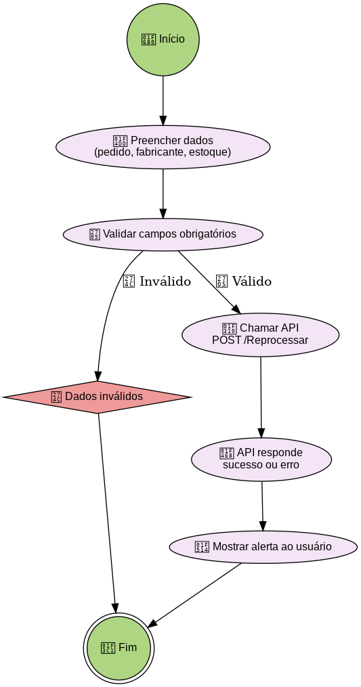
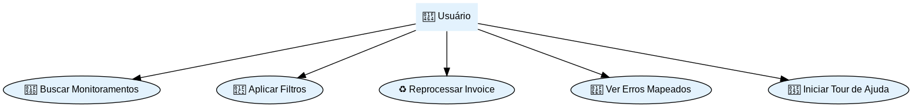
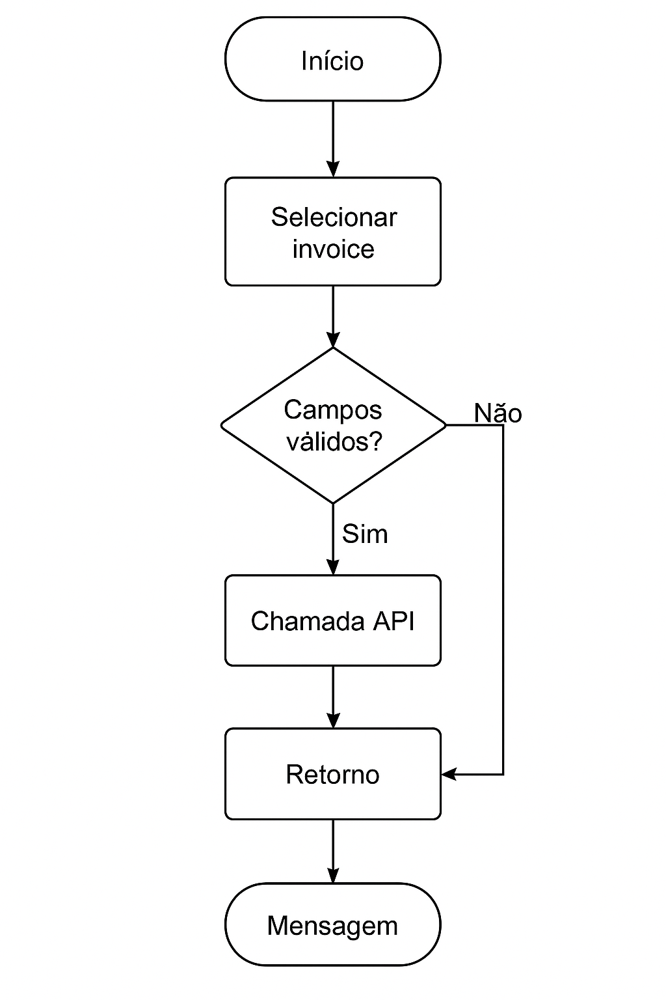
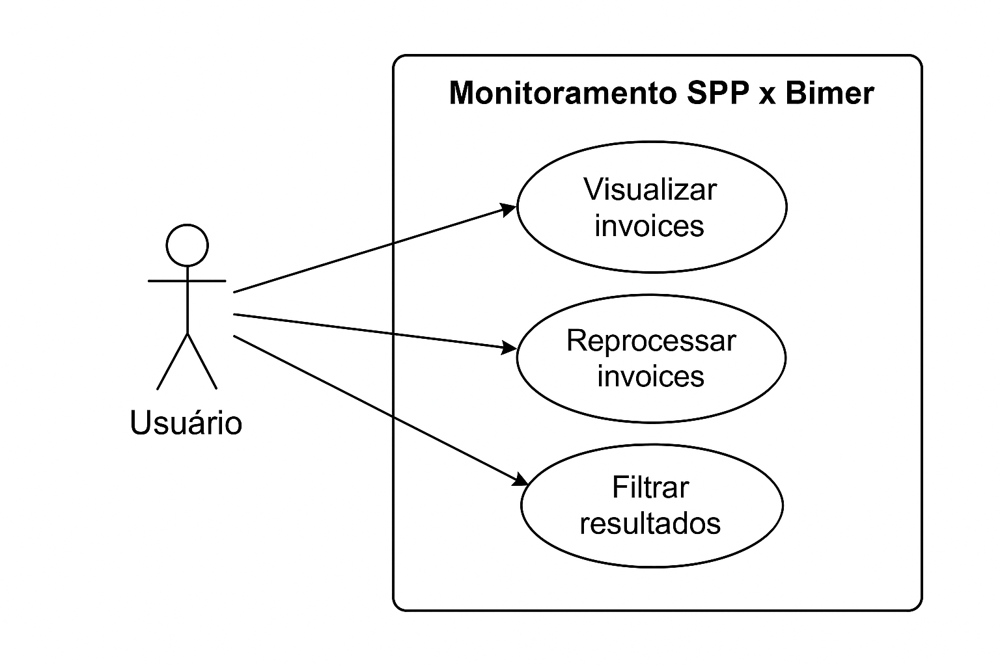
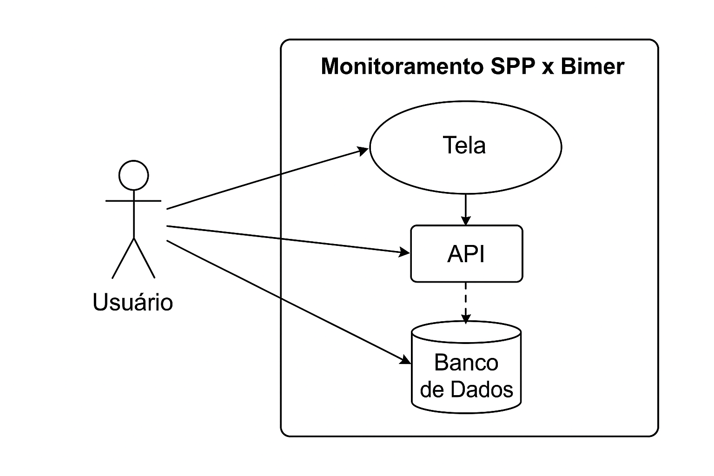

## 🧭 Índice de Seções
01. [📍 Visão Geral](#-visão-geral)
02. [⚙️ Componentes e Serviços](##componentes-e-serviços)
03. [🔁 Computed Properties e Filtros](#computed-properties-e-filtros)
04. [🧪 Reprocessamento](#reprocessamento)
05. [🗃️ Backend: API e Lógica](#backend-api-e-lógica)
06. [📊 Estatísticas e Contadores](#estatísticas-e-contadores)
07. [🧭 Diagrama de Atividades](#diagrama-de-atividades)
08. [📘 Diagrama de Caso de Uso](#diagrama-de-caso-de-uso)
09. [🔁 Diagrama de Fluxo de Dados](#diagrama-de-fluxo-de-dados)
10. [📈 Considerações Técnicas](#considerações-técnicas)
---

## 📍 Visão Geral

Este módulo Angular realiza o **monitoramento da integração entre os sistemas SPP e Bimer**, focado na sincronização de invoices.

📌 Ele permite:

- Visualizar dados integrados entre sistemas
- Filtrar por status, datas e texto livre
- Reprocessar itens com erro
- Ver mensagens de erro tratadas e reescritas

---

## ⚙️ Componentes e Serviços

### 🧩 `MonitorSppBimerComponent`

Componente Angular Standalone que utiliza:

- `signal()` e `computed()` para estado reativo
- `FormControl` para filtros de data e texto
- `MatSnackBar` para alertas
- `MatTable`, `MatFormField`, `MatDatepicker`, `MatIcon`

### 📡 Serviços Injetados

- `MonitorSppBimerService`: comunicação com a API
- `MonitorDeparaMensagensService`: mapeamento de mensagens de erro
- `Shepherd`: tour guiado interativo

---

## 🔁 Computed Properties e Filtros

- `dadosFiltrados()`: aplica filtros dinâmicos (data e texto)
- `totalRegistros()`: contagem total de registros
- `totalSucesso()`: com status "S"
- `totalErro()`: com status "N"

---

## 🧪 Reprocessamento

### 🚦 Fluxo

1. Coleta os dados: `numeroInvoice`, `fabricanteId`, `estoque`
2. Cria `ReprocessarBimerRequestDto`
3. Chama API `POST /Reprocessar`
4. Exibe mensagem via `snackbar` ou `Swal`

---

## 🗃️ Backend: API e Lógica

### Endpoints

| Método | Caminho                          | Ação                             |
|--------|----------------------------------|----------------------------------|
| GET    | `/api/Monitoramento/Spp/bimer/Invoce` | Consulta dados com filtros       |
| POST   | `/api/Monitoramento/Spp/bimer/Invoce/Reprocessar` | Executa reprocessamento          |

### DTOs

```csharp
public class MonitoramentoSppBimerInvoceDto {
  public string NumeroPedido;
  public string? NumeroInvoice;
  public string Fabricante;
  public string? FabricanteId;
  public string Estoque;
  public DateTime DataEmissao;
  public decimal ValorInvoice;
  public string StatusIntegracao;
  public string ObservacaoErro;
}

public class ReprocessarBimerRequestDto {
  public string Pedido;
  public string Estoque;
  public string? Fabricante;
}
```

---

## 📊 Estatísticas e Contadores

- `totalRegistros()`: `dados().length`
- `totalSucesso()`: `dados().filter(d => d.statusIntegracao === 'S')`
- `totalErro()`: `dados().filter(d => d.statusIntegracao === 'N')`

---

## 🧭 Diagrama de Atividades



---

## 📘 Diagrama de Caso de Uso



---

## 🔁 Diagrama de Fluxo de Dados


---

## 📈 Considerações Técnicas

### Angular 19

- Uso de `signal()` e `computed()` para gestão de estado eficiente
- Injeção via `inject()` no lugar de `constructor`
- Componentes `standalone` com melhor modularização
- Angular Material para UI rica e responsiva

### Backend ASP.NET Core

- API REST estruturada com DTOs bem definidos
- Logs de erro com `TraceId`, `UserName`, `InnerException`
- Reprocessamento controlado por `HttpClient` com parâmetros formatados

### Regras de Negócio

- Mensagens de erro traduzidas dinamicamente via `MonitorDeparaMensagensService`
- Reprocessamento somente com campos obrigatórios válidos
- Filtros aplicados tanto no backend quanto no frontend

---

## ✅ Critérios de Pronto

- [x] Filtros e busca funcionais
- [x] Tratamento visual de erros
- [x] Tour de ajuda integrado
- [x] Reprocessamento validado com logs
- [x] Documentação técnica em `.md` com diagramas

---

## 📘 Diagramas Explicativos

### 🔁 Fluxo de Reprocessamento



### 👤 Caso de Uso


### 🔀 Fluxo de Dados


---

📅 **Última atualização:** 2025-09-03  
✍️ **Autor:** Wenklesley Mendes 
📦 **Projeto:** Integração SPP x Bimer - Invoce Monitoramento
