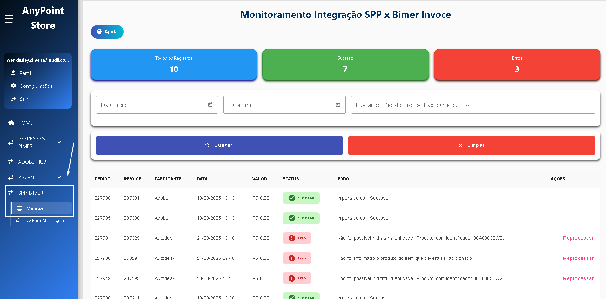
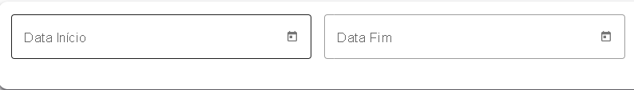
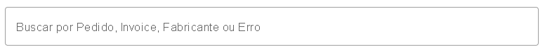
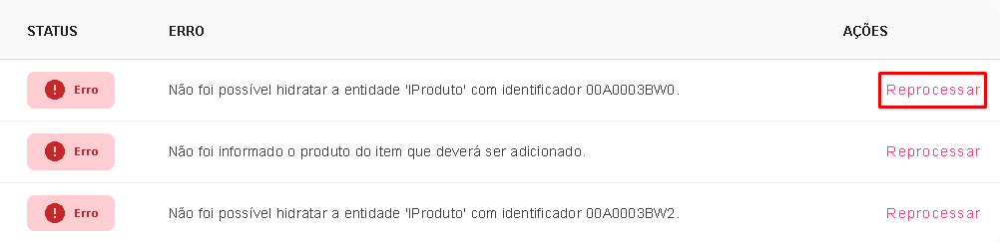
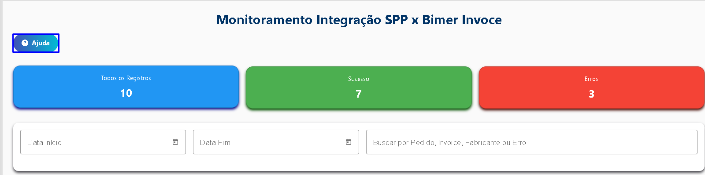

## 🧭 Visão Geral

O sistema de **Monitoramento SPP x Bimer** foi desenvolvido para acompanhar e gerenciar a integração de **invoices (notas fiscais)** entre os sistemas.  

Com ele, o usuário pode:

- 📊 **Visualizar invoices integrados** entre os sistemas  
- 🔎 **Filtrar resultados** por datas, status e texto livre  
- 🔄 **Reprocessar invoices com erro**  
- ⚠️ **Visualizar mensagens de erro traduzidas** de forma amigável  
- 🗺️ **Realizar tour de ajuda interativo** para conhecer as funções da tela  

---

## 🖥️ Acesso à Tela

Após login no sistema, acesse o menu:  
`SPP-BIMMER > Monitor`

A tela inicial exibirá uma **lista de invoices** com status e informações principais.

---

## 🔎 Filtros de Pesquisa

Na parte superior da tela, o usuário pode aplicar filtros para facilitar a busca:

- **📅 Data de emissão** → selecione o período desejado  

- **🔤 Texto livre** → permite buscar por número de pedido, invoice, fabricante ou mensagem de erro  

- **✅ Status** →  
  - **Sucesso**: integrado corretamente  
  - **Erro**: falha na integração  
  

Após configurar os filtros, clique em **Buscar**.

---

## 📊 Estatísticas

A tela mostra contadores automáticos:  

- 🔹 **Total de registros encontrados**  
- 🟢 **Sucesso** (invoices integrados corretamente)  
- 🔴 **Erro** (invoices que falharam na integração)  

Esses valores se atualizam conforme os filtros aplicados.

---

## 🔄 Reprocessamento de Invoice

Caso um invoice apresente erro, é possível reprocessá-lo:

1. Clique no botão **Reprocessar** ao lado do registro.  
2. Se os campos obrigatórios estiverem preenchidos (pedido, fabricante, estoque), a API será chamada.  
3. O usuário receberá um **alerta de sucesso ou erro**.  

📌 **Atenção:** o reprocessamento só é possível se os campos obrigatórios forem válidos.

---

## 🗺️ Tour de Ajuda

Para novos usuários, há um **tour interativo** disponível:

1. Clique em **Ajuda**.  
2. O sistema destacará as áreas da tela explicando sua função.  
3. Avance com **Próximo** até finalizar o tour.  

---

## ✅ Boas Práticas de Uso

- Sempre utilize os **filtros** antes de realizar buscas, evitando excesso de dados.  
- Utilize o **tour de ajuda** caso tenha dúvidas na navegação.  
- Reprocese apenas quando tiver certeza de que os dados obrigatórios estão corretos.  
- Em caso de falha repetida, entre em contato com o suporte informando o **número do pedido e invoice**.  

---

📅 **Última atualização:** 2025-09-12  
✍️ **Autor:** Wenklesley Mendes  
📦 **Projeto:** Integração SPP x Bimer - Monitoramento de Invoices  
